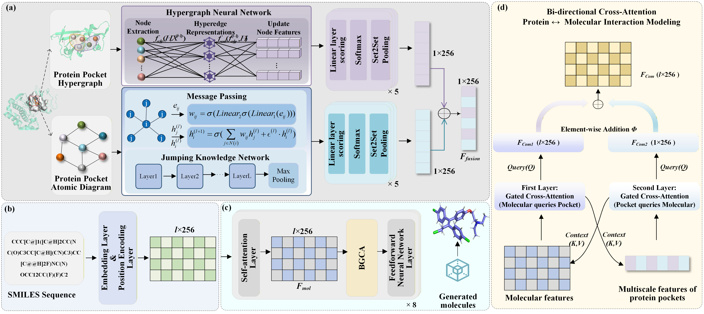

# TSMGen
The code is an official PyTorch-based implementation in the paper [TSMGen: Target-Specific Molecule Generation via Higher-Order Structural Dependencies and Context-Aware Bidirectional Fusion  ](https://icml.cc/virtual/2026/poster/63863) (Accepted in International Conference on Machine Learning , 2026).

## Abstract

Efficiently designing high-quality molecules targeting disease-relevant targets is a critical challenge. Most existing methods can capture pairwise amino acid relations, neglecting the higher-order relations among multiple amino acids. This paper proposes a target-specific molecule generation framework, namely TSMGen, to comprehensively capture the local and global structural information of the protein pocket by modeling higher-order spatial dependencies both at the atomic and the amino acid levels. Furthermore, we design a context-aware bidirectional fusion module to learn the more detailed structural information about the protein pocket. This module simultaneously attends to features from both the protein pocket and the molecule, fully leveraging the structural information from both to optimize the generation process of targeted molecules, thereby enhancing the quality of generated molecules. Experiments show that TSMGen outperforms state-of-the-art methods in terms of Vina Score, High Affinity, QED, SA and Diversity, and a case study on $\beta$-secretase enzyme further confirms its ability to generate molecules with stronger binding affinity.



## Installation
### 1. GPU environment

CUDA 11.3

### 2.create a new conda environment
```bash
conda env create -f requirements.yml
conda activate tsmgen
```

## Dataset
The dataset used for training TSMGen is [CrossDocked](https://drive.google.com/file/d/1BTbuD45VBkBoPAVdNNthdzq1f2D1sAjP/view?usp=sharing).

Unzip to a suitable location
```bash
unzip crossdocked_pocket10_mol2.zip -d /path/to/your/desired/location
```


## Citation
```bib
@inproceedings{chen2026TSMgen,
  title={TSMGen: Target-Specific Molecule Generation via Higher-Order Structural Dependencies and Context-Aware Bidirectional Fusion},
  author={Chen,Yaoyu and Lin, Xiaoli and Gong, Ziyi and Pang, Jun},
  booktitle={Proceedings of the International Conference on Machine Learning},
  year={2026}
}
```
