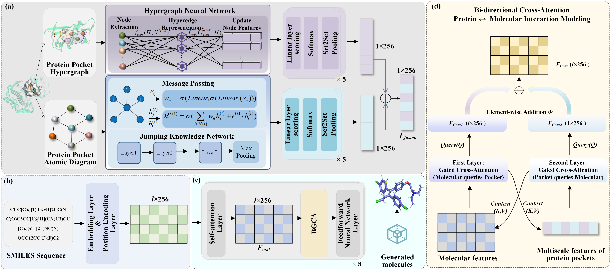

# TSMGen
The code is an official PyTorch-based implementation in the paper [TSMGen: Target-Specific Molecule Generation via Higher-Order Structural Dependencies and Context-Aware Bidirectional Fusion  ](https://icml.cc/virtual/2026/poster/63863) (Accepted in International Conference on Machine Learning , 2026).

## Abstract

Efficiently designing high-quality molecules targeting disease-relevant targets is a critical challenge. Most existing methods can capture pairwise amino acid relations, neglecting the higher-order relations among multiple amino acids. This paper proposes a target-specific molecule generation framework, namely TSMGen, to comprehensively capture the local and global structural information of the protein pocket by modeling higher-order spatial dependencies both at the atomic and the amino acid levels. Furthermore, we design a context-aware bidirectional fusion module to learn the more detailed structural information about the protein pocket. This module simultaneously attends to features from both the protein pocket and the molecule, fully leveraging the structural information from both to optimize the generation process of targeted molecules, thereby enhancing the quality of generated molecules. Experiments show that TSMGen outperforms state-of-the-art methods in terms of Vina Score, High Affinity, QED, SA and Diversity, and a case study on $\beta$-secretase enzyme further confirms its ability to generate molecules with stronger binding affinity.



## Installation
### 1. GPU environment

CUDA 11.3

### 2.create a new conda environment
```bash
conda env create -f requirements.yml
conda activate tsmgen
```

## Dataset
The dataset used for training TSMGen is [CrossDocked](https://drive.google.com/file/d/1BTbuD45VBkBoPAVdNNthdzq1f2D1sAjP/view?usp=sharing).

Unzip the file to a suitable location on your machine:
```bash
unzip crossdocked_pocket10_mol2.zip -d /path/to/your/desired/location
```


## Configuration
Open `config/train.yaml` and update the `pocket_dir` to your desired location:

```yaml
# config/train.yaml
pocket_dir: /path/to/your/desired/location
```


## Model Training

Run the training script:
```bash
python train_valid_valloss.py
```


## Sampling

Run the standard sampling or case study scripts:
```bash
python sample.py
# Or for case studies
python sample_casestudy.py
```


## Folder Structure

The folder names for docking results are timestamped to distinguish between different runs.


* **`case_study`**: For case studies.
    * Configuration parameters are in `config/sample_casestudy.yaml`. Run `sample_casestudy.py` to generate molecules.
    * Download proteins with PDB IDs `7d5u` and `7dpu` from the RCSB PDB website.
    * Use PyMOL to remove water molecules.
    * Convert to PDBQT format using OpenBabel (or manually).
    * Use the docking files in this folder, modify the configuration, and perform docking.
* **`config`**: Configuration folder.
* **`dock_file_save`**: Stores various files saved during the docking process. Folder names are timestamped.
* **`save`**: Stores the models saved after training, including their corresponding parameters. Data from subsequent sampling is also saved here. Docking results are saved in `dock_file_save`.
* **`evaluation_dock`**: Contains files for docking evaluation, including PDBQT conversion, docking, and analysis.
    * Workflow: Convert to PDBQT → Dock → Analyze high-affinity ratio and mean value.
    * `smiles2pdbqt.py`: Converts SMILES to PDBQT.
        * `smiles2pdbqt.yaml`: Corresponding configuration file.
    * `dock_qvina.py`: Performs docking.
        * `dock.yaml`: Corresponding parameter file.
    * `dock_qvina_only_result.py`: Extracts only the docking results (generally not used).
    * `get_high_affintiy.py`: Calculates the high-affinity ratio.
    * `get_vina_mean.py`: Calculates the mean affinity value.
* **`figure`**: Folder for storing images.
* **`generate`**: Utility files for sampling.
* **`metrics`**: Toolkit for evaluation metrics, such as the SA score.
* **`model`**: Contains the encoder, decoder, and other model components.


## Citation
```bib
@inproceedings{chen2026tsmgen,
  title={TSMGen: Target-Specific Molecule Generation via Higher-Order Structural Dependencies and Context-Aware Bidirectional Fusion},
  author={Chen, Yaoyu and Lin, Xiaoli and Gong, Ziyi and Pang, Jun},
  booktitle={Proceedings of the International Conference on Machine Learning},
  year={2026}
}
```
